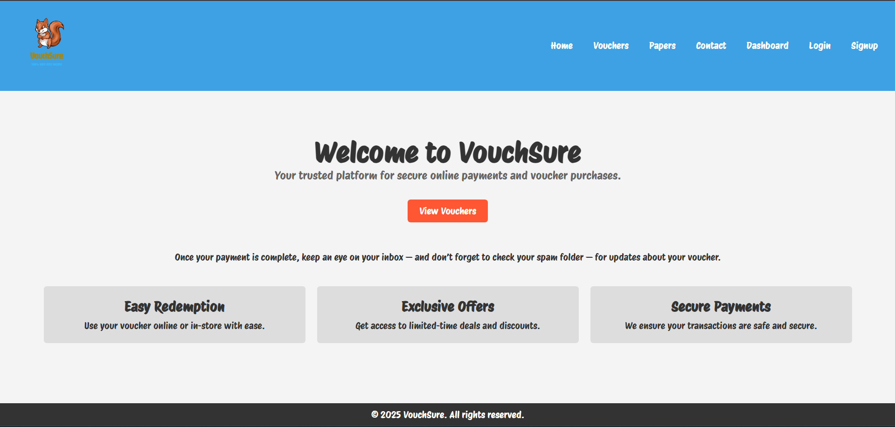
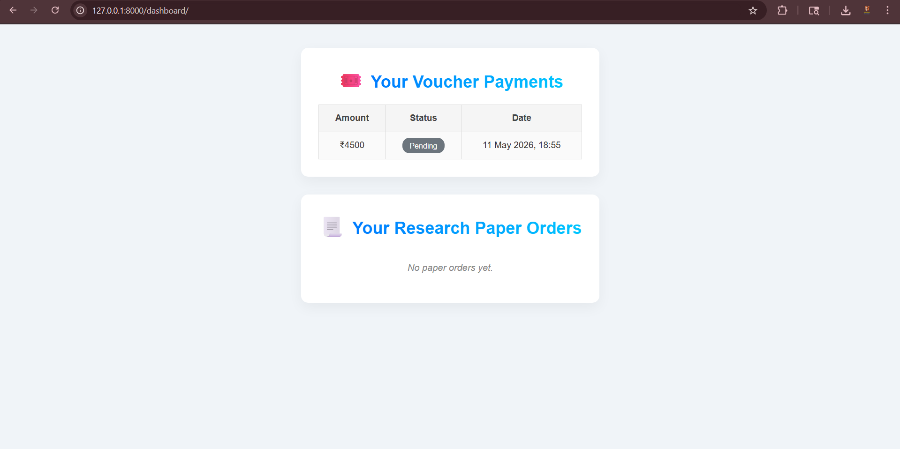
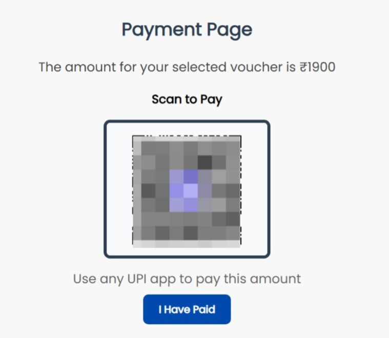
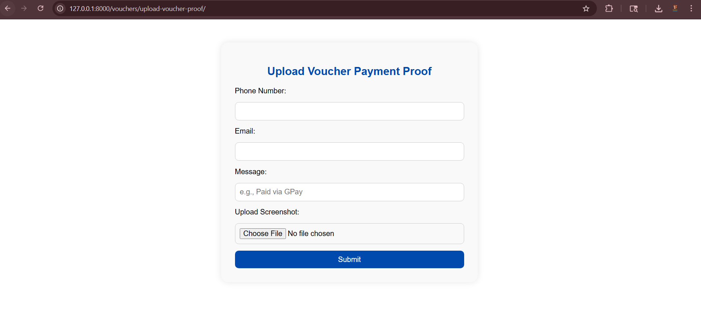
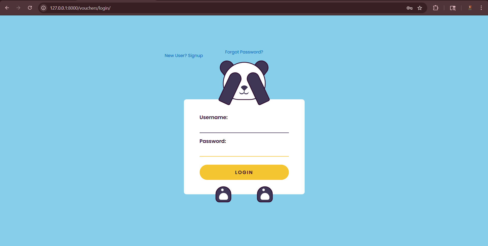
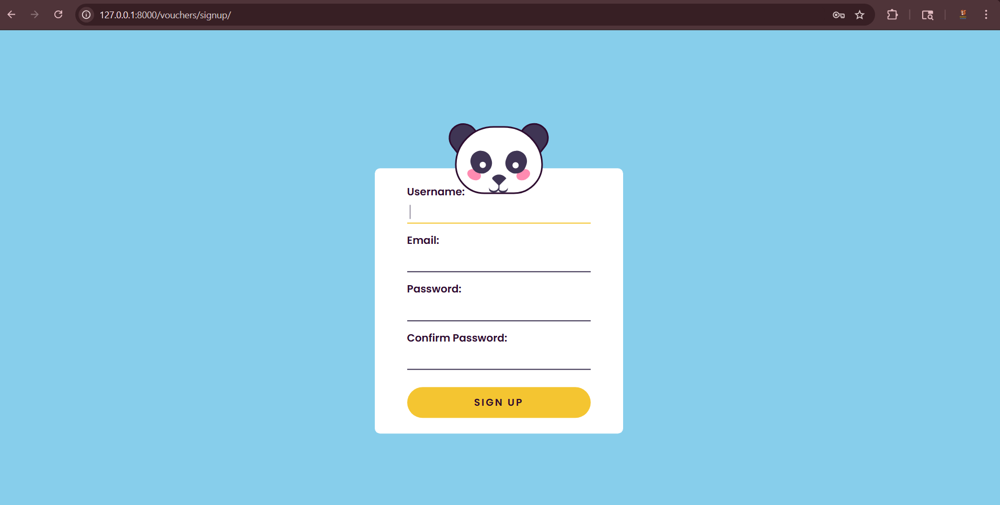

# VouchSure

VouchSure is a Django-based web application developed for managing digital voucher purchases, research paper requests, and payment verification workflows through a secure and structured platform.

The platform enables users to purchase discounted certification vouchers, place academic service requests, upload payment proof screenshots, and track order activities through a personalized dashboard system.

---

# Project Overview

VouchSure was developed as a full-stack backend-focused web platform to streamline voucher management and online service request workflows.

The system includes:

- User authentication and account management
- Voucher purchasing workflow
- Research paper/service order requests
- QR-code-based payment process
- Payment proof upload and verification
- Automated email notification system
- User dashboard for tracking activities
- Responsive frontend design

This project helped strengthen practical understanding of Django backend development, database integration, authentication systems, file handling, and workflow-based web application design.

---

# Key Features

## Authentication System
- User registration and login functionality
- Secure account-based workflow management
- Personalized dashboard access

## Voucher Purchase Workflow
- Purchase AWS certification vouchers
- Predefined pricing workflow
- QR-code-based payment handling

## Research Paper Order Management
- Submit capstone, term paper, and research paper requests
- Multi-step order process
- Structured service request workflow

## Payment Proof Upload System
- Upload payment screenshots securely
- Payment verification submission workflow
- File upload handling using Django

## Email Notification System
- Automated email alerts after payment submission
- Admin-side payment notification workflow

## User Dashboard
- Track voucher payments
- Monitor research paper orders
- View uploaded request history

## Responsive UI
- Mobile-friendly interface
- Structured page layouts
- Responsive frontend design using HTML and CSS

---

# Tech Stack

## Backend
- Python
- Django

## Database
- SQLite
- PostgreSQL (deployment-ready configuration)

## Frontend
- HTML5
- CSS3
- JavaScript

## Tools & Platforms
- Git
- GitHub
- Render
- VS Code / PyCharm

---

# Screenshots

## Homepage



---

## Dashboard



---

## Payment Page



---

## Upload Payment Proof



---

## Login Page



---

## Signup Page



---

# Installation & Setup

## Clone Repository

```bash
git clone [clone_link]
```

## Navigate to Project Directory

```bash
cd [dir_name]
```

## Create Virtual Environment

```bash
python -m venv venv
```

## Activate Virtual Environment

### Windows

```bash
venv\Scripts\activate
```

## Install Dependencies

```bash
pip install -r requirements.txt
```

## Run Database Migrations

```bash
python manage.py migrate
```

## Start Development Server

```bash
python manage.py runserver
```

---

# Future Improvements

- Online payment gateway integration
- Admin analytics dashboard
- Order status tracking system
- Enhanced validation and security features
- Cloud deployment optimization
- REST API integration
- Advanced user management system

---

# Learning Outcomes

This project helped improve understanding of:

- Django backend architecture
- CRUD operations
- Authentication workflows
- Database-driven applications
- File upload handling
- Email automation
- Responsive frontend integration
- Deployment-ready project structure
- Git and GitHub workflow management

---

# Repository Structure

```text
VouchSure/
│
├── screenshots/
├── vouchsure/
│   ├── templates/
│   ├── static/
│   ├── vouchers/
│   ├── manage.py
│
├── requirements.txt
├── README.md
├── .gitignore
```

---

# Author

Peddada Sri Vaishnavi  
Python & Django Developer

---

# Why This Project Is Valuable

This project demonstrates practical backend development skills using Django, including authentication systems, database integration, workflow-based application design, file upload handling, email automation, and responsive web development.

The platform was designed to simulate real-world service management workflows and improve understanding of scalable web application architecture.

---

# Additional Notes

- Environment variables are securely managed using `.env`
- Sensitive credentials are excluded using `.gitignore`
- Static and media file handling configured for deployment
- Project prepared for future cloud deployment integration

---

# GitHub Repository

Repository Link:

https://github.com/srivaishnavipeddada/VouchSure


